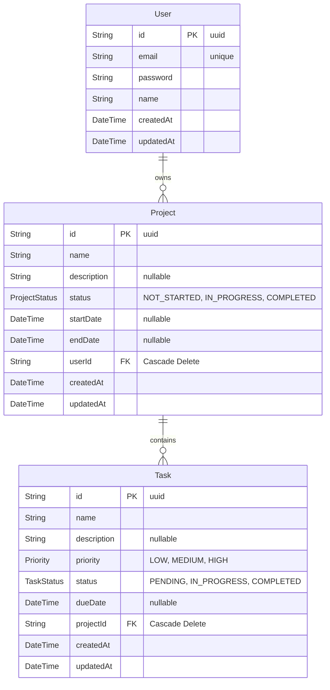

# Project Management System - Database Schema

The application uses PostgreSQL with Prisma ORM. Below is the Entity-Relationship (ER) diagram representing the database architecture.

> [!NOTE]
> The database also contains a `_prisma_migrations` table used internally by Prisma to track schema changes.
